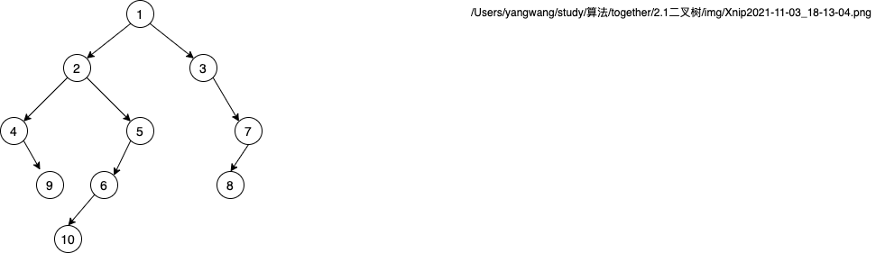

<!--
 * @Description  : 二叉树
 * @Autor        : yanwang
 * @CreateDate   : 2021-11-17 15:58:12
 * @LastEditors  : yanwang
 * @LastEditTime : 2021-12-20 09:55:09
-->
## 树结构

1. 只看一条边，是一条链表。 链表是一条特殊的树型结构（指针域1）。但平时不会这么叫。

   链表到树的差异：

   ```javascript
   // 1. 链表
   class Node {
     constructor(value, next = null) {
       this.val = value;
       this.next = next;
     }
   }
   // 2. 三叉树
   class TreeNode {
     constructor(value, next = null) {
       this.val = value;
       this.next = [TreeNode, TreeNode, TreeNode];
     }
   }
   ```

2. 不存在着任何环的数据结构。 一对多。

3. 出度，入度

## 二叉树

### 性质 :  思考

1. 2^0  2^1  2^2

2. 2^0 + 2^1 + 2^2 ...

   a1( 1 - q^k ) / (1 - q) = 1 * (1 - 2^k) / (1 - 2) = 1 - 2^k / -1 = 2^k - 1

3. 总节点数 = 总边数 + 1    //  根节点 上面没有边吊着

   ```
   n0 + n1 + n2 = 0 + n1 + 2n2 + 1
   n0 = n2 + 1
   ```

### 生成二叉树


### 操作

1. 遍历

   + 重要的三种遍历方式： 前、中、后遍历练习。
   + 根据根节点所在的遍历位置来区分 - 相对每个节点而言。

2. 练习

   1. 写出前中后遍历结果

      1. ABDHIEJCFG
      2. HDIBJEAFCG
      3. HIDJEBFGCA

   2. 根据 中序 + 前/后 遍历结果，还原二叉树。 

      前： 1 2 4 9 5 6 10 3 7 8 
      ​中:    4 9 2 10 6 5 1 3 8 7               

​	结果：

### 二叉树分类

1. 完全二叉树 (complete binary tree)：只有最后一层的右侧缺少节点的二叉树。

   + 有且只有最后一层不是满的。
   + 最后一层的结点是从左开始排列的。

2. 满二叉树 (full binary tree) ： 没有度为1的节点。

   + 所有结点的度都是 0 或 2 的二叉树。

3. 完美二叉树 (perfect binary tree):

   + 二叉树上每一层的结点数都达到了最大。看上去就像上个三角形。 

   几种二叉树的定义在不同的资料说明中可能存在一定差异，因此在实际场合中提到时请务必进行确认。

   

### 完全二叉树

+ 节省存储边的空间

+ 算法思想： 计算式  和 记录式 之间的转换
  + 普通二叉树 - 记录式 节省时间
  + 完全二叉树 - 计算式 节省空间
  + 哪个好 ？？？
+ 完全二叉树存储在数组中是线性的一维数列，但在我们脑子中是一个树状结构。

### 树结构的深入理解

节点代表： 集合。     全集/子集
边代表： 关系。

书结构的应用： 各种场景下的查找操作。

### 二叉树作用

1. AVL树： 标准语言库中重要的数据检索底层实现

   B+ / B- 树： 文件系统、数据库底层重要数据结构

2. 左孩子右兄弟 - 节省空间。

   假设有n个节点, 浪费的边数：

   ​	有效的边数：n - 1 个（根节点不需要边指向）

   ​	浪费的指针域： n个节点，n-1条有效的边

   ​		k叉树： k * n - ( n - 1)  => (k - 1) * n  + 1

   ​		2叉树：2 * n - (n - 1)   =>  n + 1

   ​	得出，叉越多，节点越多，浪费的指针域越多。

3. 练习递归的最佳选择

### 递归流程： 

1. 数学归纳法

   + k0是正确的

   + 假设ki 是正确的，推导出 k i+1 也是正确的

   + 则所有的 kn就是正确的

     斐波那契数列： 

     ```javascript
     // fib(n) : 第n项斐波那契的值
     function fib(n) {
       if(n <= 2) return n;  // k0
       // 假设fib(n - 1)正确，fib(n - 2)正确；
       // 则可以推出：fib(n) 一定是正确的
       return fib(n - 1) + fib(n - 2); 
     }
     ```

2. 赋予递归函数一个明确的意思

3. 思考边界条件

4. 实现

   

   前序遍历二叉树：

   + 意义： 前序遍历以root为根结点的二叉树
   + 边界：root为空时不需要遍历
   + 递归过程： 前序遍历左子树，前序遍历右子树

二叉树前顺遍历： 

学习递归思维方式，不断的去锻炼这套思维方式

## 算法题

##### 随堂讲解

1. 144.二叉树的前序遍历 
2. 105.从前序与中序遍历序列构造⼆叉树

##### 作业

1. 589.N 叉树的前序遍历 
2. 226.翻转⼆叉树 
3. 剑指Offer 32 - II.从上到下打印⼆叉树Ⅱ
4. 107.⼆叉树的层序遍历Ⅱ 
5. 103.⼆叉树的锯⻮形层序遍历

##### 延伸

1. 110.平衡⼆叉树 
2. 112.路径总和
3. 222.完全⼆叉树的节点个数
4. 剑指Offer 54.⼆叉搜索树的第 k ⼤节点 
5. 剑指Offer 26. 树的子结构
6. 968.监控二叉树
7. 662二叉树最大宽度


